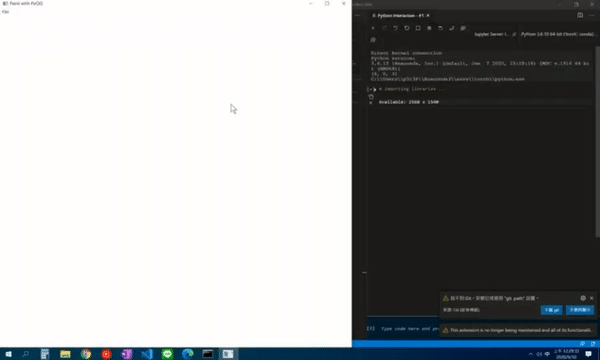

# Pytorch深度學習框架X NVIDIA JetsonNano應用-pix2pix圖片自動填色

| 作者 | Chia-Chun, Chang |
| ---- | ---|
| 所屬單位  | Cavedu 教育團隊 |
| 開發日期  | 10909 |
| 文章連結  | https://www.rs-online.com/designspark/pytorchx-nvidia-jetsonnano-cdcgan-2-cn |

# 簡介
說到風格轉換第一個想到的就是 pix2pix，他算是很早期透過 cGAN 的方式去完成圖像與圖像之間的翻譯，是風格轉換的經典作品之一，風格轉換有很多種有趣的應用，像是從語意分析圖轉換成實體圖片，又或者將衛星地圖轉換成簡化地圖，也有給輪廓去填顏色，這些都算是風格轉換也算是 pix2pix 提供範例的範疇。

